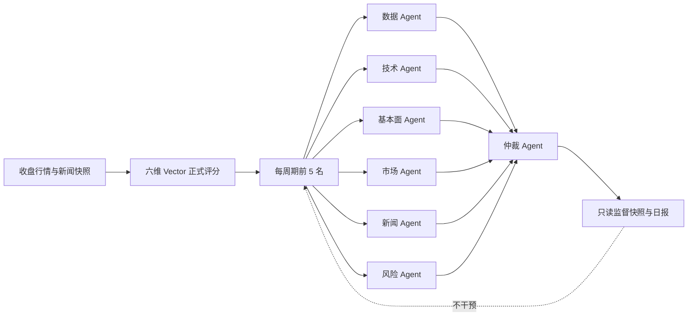

# Glimmer Agent Swarm 系统介绍与使用说明

## 定位

Agent Swarm 是 `horizon-vector-v2` 外围的**只读研究与监督层**。正式候选仍由六维 Vector 评分、按六个周期分别排序并选出 5 只；Swarm 不修改候选、正式分数、名次、周期权重或已经写入的历史日志。

当前实现是可在 GitHub Actions 中稳定复现的确定性专业 Agent，而不是每天调用外部大模型。这样可以保证同一输入得到同一结论、无需 API 密钥，并保留完整审计证据。未来可把大模型研究结果作为新的独立 Agent 接入，但不能绕过数据截止日和不可变日志约束。

## 实现与详细文档

公共入口是 `scripts/lib/forecast-swarm.mjs`，编排逻辑位于 `scripts/lib/forecast-swarm/orchestrator.mjs`，每个子 Agent 都有独立实现和独立设计文档：

| Agent | 实现模块 | 详细文档 |
|---|---|---|
| 数据 Agent | `agents/data-agent.mjs` | [数据 Agent](agents/data-agent.md) |
| 技术 Agent | `agents/technical-agent.mjs` | [技术 Agent](agents/technical-agent.md) |
| 基本面 Agent | `agents/fundamental-agent.mjs` | [基本面 Agent](agents/fundamental-agent.md) |
| 市场 Agent | `agents/market-agent.mjs` | [市场 Agent](agents/market-agent.md) |
| 新闻 Agent | `agents/news-agent.mjs` | [新闻 Agent](agents/news-agent.md) |
| 风险 Agent | `agents/risk-agent.mjs` | [风险 Agent](agents/risk-agent.md) |
| 仲裁 Agent | `agents/arbitration-agent.mjs` | [仲裁 Agent](agents/arbitration-agent.md) |

统一输入输出契约、版本规则和优化检查清单见 [子系统索引](agents/README.md)。

**重要：当前所有 Swarm 公式和参数都是 E1 人工工程先验，未经过历史拟合或充分样本外验证。** 参数逐项来源、证据等级、当前校准问题和升级流程见 [参数来源与证据等级](agents/parameter-provenance.md)。

项目另有一套 [Research-grounded Shadow Swarm v2](agents/research-grounded-v2.md)：依据动量、中国价值与规模、流动性、波动和金融文本论文调整参数，并通过置信度向中性收缩。它仍未达到 E2，只从下一新交易日并行记录，不回填旧日志、不进入训练、不改变正式结果。

## 架构

每个新正式预测会同时运行七个角色：

1. **数据 Agent**：检查必需行情字段、来源状态和输入完整性。
2. **技术 Agent**：复核价格动能、交易参与和波动稳定。
3. **基本面 Agent**：使用当时可得的市盈率、规模和流动性做约束判断。由于暂缺完整财报，其置信度主动降低。
4. **市场 Agent**：检查核心指数广度和市场情境是否顺风。
5. **新闻 Agent**：核验股票名称或代码的标题级直接证据；无直接证据时保持中性，不推断利好。
6. **风险 Agent**：主动寻找涨幅过热、异常量比、高振幅、高估值和小市值风险。它输出的是“安全余量”，分数越低风险越高。
7. **仲裁 Agent**：汇总前六个角色，记录支持、中性或质疑结论以及专业分歧，但不回写正式评分。

## 仲裁口径

监督共识分仅用于研究展示：

$$
C=0.15D+0.25T+0.15F+0.15M+0.10N+0.20R
$$

其中 $R$ 是风险 Agent 的安全余量，不是风险严重度。该公式不是正式选股公式，也不会参与排序。

- **支持**：共识分至少 65，且数据、风险 Agent 没有硬性质疑。
- **中性**：证据有限或共识处于中间区间。
- **质疑**：共识低于 48，或数据、风险 Agent 触发硬性质疑。
- **高分歧**：专业 Agent 最高分与最低分相差至少 35，标记为人工复核。

## Daily run 如何工作

每天收盘后的现有流水线会：

1. 拉取行情、板块和新闻。
2. 只有核心行情不是缓存时才允许创建新预测。
3. 使用六维 Vector 生成正式候选和不可变因子快照。
4. 对每个新候选运行六个专业 Agent 和仲裁 Agent。
5. 保存每个 Agent 的分数、置信度、信号、警告、证据、数据截止日和输入 SHA-256 哈希。
6. 生成当日 Swarm 覆盖率、支持/中性/质疑计数和高分歧名单。
7. 运行预测数据校验；结构、引用或非干预约束不正确时校验失败。

Swarm 的规则参数不会根据在途浮盈亏自动改变。正式 Vector 的经验校准仍只使用已经到期、且在下一交易日才可用的样本。

## 页面使用方法

1. 进入“周期选股”。
2. 在研究日历选择日期，再选择一周至一年中的观察周期。
3. 先看候选的正式综合分、六维 Vector 和“为什么选择它”。
4. 展开候选底部的 **AGENT SWARM**：
   - 看仲裁结论与共识分；
   - 看分歧等级；
   - 对照七个角色的信号、警告和置信度；
   - “质疑”或“高分歧”只表示需要进一步研究，不是自动卖出指令。
5. 在“七角色 Agent Swarm”面板查看当日覆盖率和架构说明。
6. 在每日三省中的“Swarm 监督日报”查看整日汇总。

启用日前的日志会显示“未运行”。系统不会用今天的信息补写过去的监督结论。

## 数据结构

新运行增加：

- `model.swarm`：版本、角色、策略和非干预声明。
- `runs[].swarmVersion`：该运行使用的 Swarm 版本。
- `runs[].swarmSummary`：日级覆盖、仲裁分布和高分歧列表。
- `runs[].predictions[].swarmReview`：候选级六 Agent 输出、仲裁和审计轨迹。
- `reports[].swarmReflection`：Swarm 日报。
- `audit.swarmReviewedPredictionCount`：已监督预测总数。

## 安全与研究边界

- 所有 Agent 只能读取预测日当时可见的输入。
- 已生成的正式预测及 Swarm 快照都不能事后改写。
- 活跃样本不能用于调参。
- 历史回放保持 `trainingEligible: false`，不进入正式胜率或经验池。
- 新闻仅做标题级辅助核验。
- Agent 结论是概率研究证据，不构成收益保证或投资指令。

## 本地验证

项目使用 Node.js 22。运行日更脚本后，再运行预测校验脚本。校验器会检查六周期每期五只、追踪引用、七角色输出、输入哈希、Swarm 覆盖率和只读非干预约束。
